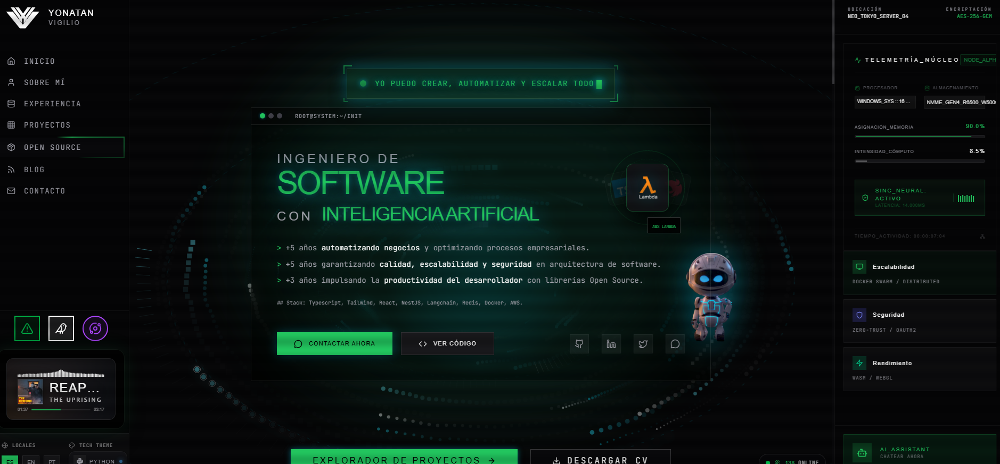

<div align="center">

# 🚀 VIGILIO — Portfolio

**Ingeniero de Software con Inteligencia Artificial**



[](https://nestjs.com/)
[](https://astro.build/)
[](https://www.postgresql.org/)
[-00C853?style=for-the-badge&logo=redis&logoColor=white>)](https://www.dragonflydb.io/)
[](https://orm.drizzle.team/)
[](https://www.docker.com/)

> 🧠 _+5 años automatizando negocios y optimizando procesos empresariales._
> _Garantizando calidad, escalabilidad y seguridad en arquitectura de software._

---

</div>

## 📦 Librerías Principales

| Backend      | Frontend        | Infra             |
| ------------ | --------------- | ----------------- |
| NestJS 11    | Astro 5         | PostgreSQL        |
| Drizzle ORM  | Preact          | Dragonfly (Redis) |
| Passport JWT | TailwindCSS     | MinIO/RustFS      |
| Zod          | React Hook Form | Docker            |

## 🚀 Setup Rápido

```bash
# 1. Instalar
pnpm install

# 2. Configurar
cp .env.example .env

# 3. Levantar servicios
docker compose up -d

# 4. Base de datos
sudo service postgresql start
pnpm run db:push
pnpm run db:seed

# 5. Desarrollo
pnpm serve    # Backend :4000
pnpm dev      # Frontend :3000
```

## 🧪 Testing (E2E con DB Real)

Este proyecto usa **Vitest** contra una base de datos PostgreSQL real (`test_db`) para garantizar fiabilidad total.

### 1. Preparar Entorno de Pruebas

Crea el archivo `.env.test` (si no existe) y asegúrate de que apunte a `test_db`:

```bash
cp .env.test.example .env.test
```

### 2. Configurar Base de Datos de Test

Esto crea/actualiza la base de datos `test_db` con el schema más reciente:

```bash
pnpm db:push:test
```

### 3. Ejecutar Tests

Corre todos los tests E2E (Users, Tenants, Auth, etc.):

```bash
pnpm test:e2e:db
```

> **Nota:** Los tests limpian (`TRUNCATE`) la DB automáticamente. No uses una DB con datos importantes.

## 🌿 Git Branching Strategy

### Setup Inicial (solo una vez)

```bash
# Crear rama develop
git checkout -b develop
git push -u origin develop
```

### Ramas

| Rama        | Propósito              | Deploy           |
| ----------- | ---------------------- | ---------------- |
| `main`      | Producción (estable)   | Con tag `v*.*.*` |
| `develop`   | Staging/desarrollo     | Automático       |
| `feature/*` | Nuevas funcionalidades | Sin deploy       |
| `wip/*`     | Trabajo en progreso    | Sin CI           |

### Flujo de Trabajo

```bash
# 1. Nueva feature
git checkout develop
git checkout -b feature/mi-feature

# 2. Desarrollo
git commit -m "feat: nueva funcionalidad"
git push origin feature/mi-feature

# 3. Merge a develop (deploy staging)
git checkout develop
git merge feature/mi-feature
git push origin develop

# 4. Producción (cuando staging OK)
git checkout main
git merge develop
git push origin main
git tag v1.0.0
git push origin v1.0.0
```

## 🔄 CI/CD Pipeline

Este proyecto usa **Gitea Actions** con seguridad nivel enterprise.

### Arquitectura de Pipelines

```
┌─────────────────────────────────────────────────────────────────────────────┐
│                           GITEA ACTIONS WORKFLOWS                            │
├─────────────────────────────────────────────────────────────────────────────┤
│                                                                             │
│  ┌─────────────┐    ┌─────────────┐    ┌─────────────┐    ┌─────────────┐  │
│  │   ci.yml    │    │deploy.staging│   │deploy.prod  │    │security.yml │  │
│  │ (PR/Push)   │    │  (develop)  │    │   (tags)    │    │ (schedule)  │  │
│  └─────────────┘    └─────────────┘    └─────────────┘    └─────────────┘  │
│         │                  │                  │                  │          │
│         ▼                  ▼                  ▼                  ▼          │
│  ┌─────────────┐    ┌─────────────┐    ┌─────────────┐    ┌─────────────┐  │
│  │ • Quality   │    │ • Quality   │    │ • Validate  │    │ • Deps Audit│  │
│  │ • Tests     │    │ • Build     │    │ • QGate     │    │ • Container │  │
│  │ • Build     │    │ • Deploy    │    │ • Security  │    │ • Secrets   │  │
│  │ • Security  │    │ • Notify    │    │ • Build     │    │ • Report    │  │
│  │ • Container │    │             │    │ • Deploy    │    │             │  │
│  │             │    │             │    │ • Rollback  │    │             │  │
│  │             │    │             │    │ • Smoke     │    │             │  │
│  │             │    │             │    │ • Notify    │    │             │  │
│  └─────────────┘    └─────────────┘    └─────────────┘    └─────────────┘  │
│                                                                             │
└─────────────────────────────────────────────────────────────────────────────┘
```

### Workflows Detallados

#### 1. `ci.yml` - Continuous Integration

| Job                  | Trigger   | Descripción                      | Timeout |
| -------------------- | --------- | -------------------------------- | ------- |
| `quality`            | push/PR   | Lint con Biome                   | 10m     |
| `test`               | push/PR   | Unit + E2E tests con coverage    | 15m     |
| `build`              | push/PR   | Build client + server            | 15m     |
| `security`           | push/PR   | pnpm audit + secrets scan + SBOM | 10m     |
| `container-security` | push only | Trivy vulnerability scan         | 15m     |

#### 2. `deploy.staging.yml` - Deploy Automático a Staging

| Job            | Trigger       | Descripción             | Timeout |
| -------------- | ------------- | ----------------------- | ------- |
| `quality-gate` | push develop  | Lint + Tests completos  | 15m     |
| `build`        | after quality | Docker build & push     | 20m     |
| `deploy`       | after build   | SSH deploy + migrations | 10m     |
| `notify`       | always        | Discord notification    | 5m      |

#### 3. `deploy.prod.yml` - Deploy a Producción

| Job             | Trigger             | Descripción                            | Timeout |
| --------------- | ------------------- | -------------------------------------- | ------- |
| `validate`      | manual only         | Requiere escribir "DEPLOY"             | 5m      |
| `quality-gate`  | after validate      | Lint + Tests completos                 | 15m     |
| `security-scan` | after validate      | pnpm audit crítico                     | 10m     |
| `build`         | after QG + security | Docker build + SBOM + provenance       | 20m     |
| `deploy`        | after build         | SSH deploy + migrations + healthcheck  | 15m     |
| `rollback`      | on failure          | Rollback automático a versión anterior | 10m     |
| `smoke-tests`   | on success          | Health + API + Frontend tests          | 5m      |
| `notify`        | always              | Discord con status detallado           | 5m      |

#### 4. `security.yml` - Auditoría de Seguridad

| Job                | Trigger       | Descripción           | Timeout |
| ------------------ | ------------- | --------------------- | ------- |
| `dependency-audit` | schedule/push | pnpm audit + SBOM     | 10m     |
| `container-scan`   | schedule/push | Trivy HIGH/CRITICAL   | 20m     |
| `secret-scan`      | schedule/push | TruffleHog + patterns | 10m     |
| `report`           | always        | Summary + Discord     | 5m      |

### Branches y Triggers

| Branch         | ci.yml     | deploy.staging | deploy.prod | security.yml  |
| -------------- | ---------- | -------------- | ----------- | ------------- |
| `main`         | ✅ push/PR | ❌             | ❌          | ✅ push       |
| `develop`      | ✅ push/PR | ✅ auto        | ❌          | ✅ push       |
| `feature/*`    | ❌         | ❌             | ❌          | ❌            |
| `wip/*`        | ❌         | ❌             | ❌          | ❌            |
| `v*.*.*` (tag) | ❌         | ❌             | ✅ auto     | ❌            |
| Schedule       | ❌         | ❌             | ❌          | ✅ Sunday 3am |

### Deploy a Producción

```bash
# Opción 1: Via tag (automático)
git tag v1.0.0
git push origin v1.0.0

# Opción 2: Manual dispatch (requiere confirmación)
# Gitea → Actions → Deploy Production → Run workflow
# Escribir "DEPLOY" + razón del deploy
```

### Rollback

El rollback es **automático** si el deploy falla. Manualmente:

```bash
# En el servidor
export IMAGE_TAG=1.0.0   # versión anterior
docker compose -f docker-compose.production.yml pull
docker compose -f docker-compose.production.yml up -d
```

## 💾 Guardar Trabajo (Cambiar de PC)

Si necesitas guardar tu trabajo para continuar en otro PC:

```bash
# PC Actual - Guardar trabajo
git checkout -b wip/mi-trabajo
git add .
git commit -m "wip: trabajo en progreso"
git push origin wip/mi-trabajo

# Otro PC - Recuperar trabajo
git fetch && git checkout wip/mi-trabajo
```

> **Nota:** Las branches `wip/*` no disparan CI, puedes pushear código incompleto.

### Después de terminar

```bash
# Merge a develop
git checkout develop
git merge wip/mi-trabajo
git push origin develop

# Borrar branch wip
git branch -d wip/mi-trabajo
git push origin --delete wip/mi-trabajo
```

## ⚙️ Variables Requeridas (Gitea)

Configurar en: **Settings → Variables** (no son secretas, visibles)

| Variable              | Valor Ejemplo               | Descripción                |
| --------------------- | --------------------------- | -------------------------- |
| `NODE_VERSION`        | `24`                        | Versión de Node.js         |
| `PNPM_VERSION`        | `10`                        | Versión de pnpm            |
| `POSTGRES_VERSION`    | `16`                        | Versión de PostgreSQL (CI) |
| `PORT`                | `4000`                      | Puerto de la app           |
| `REDIS_VERSION`       | `7`                         | Versión de Redis (CI)      |
| `REGISTRY_URL`        | `gitea.tudominio.com`       | URL del registro de Docker |
| `PROD_APP_URL`        | `https://miapp.com`         | URL de producción          |
| `PROD_DEPLOY_PATH`    | `/home/dokploy/app/prod`    | Path de deploy producción  |
| `STAGING_APP_URL`     | `https://staging.miapp.com` | URL de staging             |
| `STAGING_DEPLOY_PATH` | `/home/dokploy/app/staging` | Path de deploy staging     |

## 🔐 Secrets Requeridos (Gitea)

Configurar en: **Settings → Secrets**

| Secret              | Descripción                  | Cómo obtenerlo                                            |
| ------------------- | ---------------------------- | --------------------------------------------------------- |
| `REGISTRY_USERNAME` | Usuario de Gitea             | Tu usuario de login en Gitea                              |
| `REGISTRY_TOKEN`    | Token de acceso              | Gitea → Settings → Applications → Generate Token          |
| `SERVER_IP`         | IP del servidor              | IP pública de tu VPS/servidor                             |
| `SERVER_USER`       | Usuario SSH                  | Usuario con acceso SSH (ej: `dokploy`, `root`)            |
| `SSH_PRIVATE_KEY`   | Llave SSH privada            | `cat ~/.ssh/id_rsa` (la llave privada completa)           |
| `SSH_PORT`          | Puerto SSH                   | Por defecto `22`, o tu puerto personalizado               |
| `PROD_ENV_FILE`     | Contenido de .env producción | Copia todo el contenido de tu `.env` de producción        |
| `STAGING_ENV_FILE`  | Contenido de .env staging    | Copia todo el contenido de tu `.env` de staging           |
| `DISCORD_WEBHOOK`   | Webhook para notificaciones  | Discord → Server Settings → Integrations → Webhooks → New |

## 🔒 Seguridad del CI

Este proyecto implementa **seguridad nivel enterprise** en el CI pipeline.

### Security Features

| Feature              | Descripción                                 | Estado |
| -------------------- | ------------------------------------------- | ------ |
| **SHA Pinning**      | Actions pinneadas por commit hash           | ✅     |
| **Timeouts**         | Límites de tiempo en todos los jobs         | ✅     |
| **pnpm audit**       | Falla en vulnerabilidades críticas          | ✅     |
| **Secrets Scanning** | Detecta credenciales hardcodeadas           | ✅     |
| **SBOM**             | Software Bill of Materials (CycloneDX)      | ✅     |
| **Trivy**            | Container vulnerability scanning            | ✅     |
| **CODEOWNERS**       | Revisión obligatoria para archivos críticos | ✅     |
| **Renovate**         | Auto-update de dependencias y SHAs          | ✅     |

### Actions Pinneadas

| Action               | SHA                                        | Versión |
| -------------------- | ------------------------------------------ | ------- |
| `actions/checkout`   | `11bd71901bbe5b1630ceea73d27597364c9af683` | v4.2.2  |
| `actions/setup-node` | `39370e3970a6d050c480ffad4ff0ed4d3fdee5af` | v4.1.0  |
| `pnpm/action-setup`  | `a7487c7e89a18df4991f7f222e4898a00d66ddda` | v4.1.0  |

### Verificar SHAs

```bash
# Verificar SHA de cualquier action
git ls-remote --tags https://github.com/pnpm/action-setup.git | grep v4.1.0

# Output esperado:
# 7088e561eb65bb68695d245aa206f005ef30921d  refs/tags/v4.1.0
# a7487c7e89a18df4991f7f222e4898a00d66ddda  refs/tags/v4.1.0^{}  ← Este es el SHA del commit
```

> **Nota:** El SHA con `^{}` es el commit real del tag (el que usamos). Renovate actualiza estos SHAs automáticamente.

### Archivos de Seguridad

| Archivo                   | Propósito                                               |
| ------------------------- | ------------------------------------------------------- |
| `.gitea/CODEOWNERS`       | Define propietarios de código para revisión obligatoria |
| `renovate.json`           | Configuración de auto-update de dependencias            |
| `.gitea/workflows/ci.yml` | Pipeline con todas las validaciones de seguridad        |

## 📚 Documentación

- [Arquitectura y Prácticas](./docs/ARCHITECTURE.md)
- [API Reference](/reference) - Swagger/Scalar
- [Postman Collection](./docs/postman.json)

## 🧞 Comandos

| Comando               | Descripción          |
| --------------------- | -------------------- |
| `pnpm dev`            | Astro dev server     |
| `pnpm serve`          | NestJS dev server    |
| `pnpm test`           | Ejecutar tests       |
| `pnpm test:e2e`       | Tests E2E            |
| `pnpm run biome`      | Lint y formato       |
| `pnpm run db:migrate` | Ejecutar migraciones |
| `pnpm run db:push`    | Push schema a DB     |
| `pnpm run db:studio`  | Drizzle Studio       |
