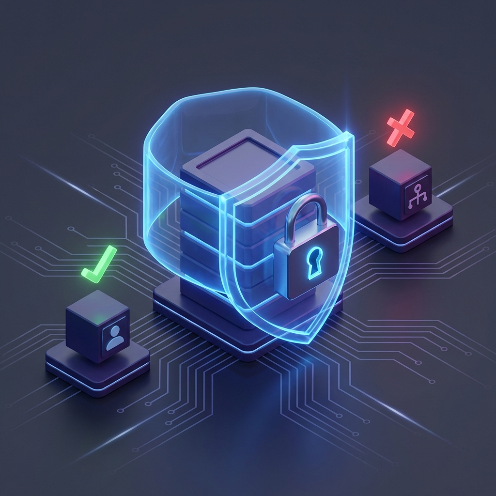
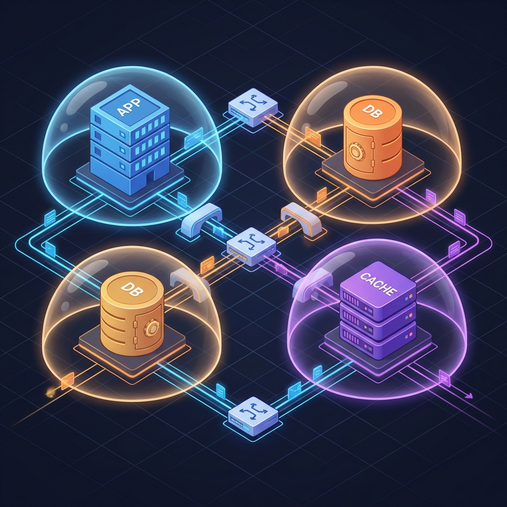

### ESPAÑOL (ES)

Desplegar una aplicación Node.js en un contenedor Docker es sencillo; hacerlo de forma segura, eficiente y preparada para entornos de producción masivos es un reto de ingeniería que separa a los juniors de los ingenieros senior. Un senior no se limita a usar la imagen oficial de Node; optimiza el tamaño de la imagen para acelerar los despliegues, endurece la seguridad para mitigar ataques y configura la gestión de recursos para evitar que un contenedor hunda al resto del nodo. En este artículo, analizaremos las mejores prácticas senior para llevar tus contenedores de Node.js, Express y Drizzle a producción con total confianza.

#### 1. Estrategia de Imágenes: Multi-stage Builds y Distroless


El tamaño de la imagen importa, no solo por el almacenamiento, sino por el "cold start" en servicios como AWS Fargate o Google Cloud Run. Una imagen pesada tarda más en descargarse y desempaquetarse, lo que retrasa la escala automática.

- **Multistage Builds**: Dividimos el proceso en una etapa de construcción (build) y otra de ejecución (runtime). En la etapa de build instalamos todas las dependencias (incluyendo las de desarrollo para compilar TypeScript); en la de runtime, solo incluimos los binarios compilados y las `dependencies` de producción.
- **PNPM Fetch**: Una técnica senior es usar `pnpm fetch` para descargar las dependencias basándose solo en el lockfile, permitiendo que Docker cachee las dependencias de forma mucho más eficiente.
- **Imágenes Base**: Preferimos imágenes minimalistas como `node:lts-alpine` o, para máxima seguridad, imágenes `distroless` de Google. Las imágenes distroless no contienen shells (como sh o bash), gestores de paquetes ni utilidades innecesarias, reduciendo drásticamente la superficie de ataque.

```dockerfile
# Etapa 1: Build
FROM node:20-alpine AS builder
WORKDIR /app
RUN npm install -g pnpm
COPY pnpm-lock.yaml ./
RUN pnpm fetch
COPY . .
RUN pnpm install --offline
RUN pnpm build

# Etapa 2: Runtime
FROM node:20-alpine
WORKDIR /app
COPY --from=builder /app/dist ./dist
COPY --from=builder /app/node_modules ./node_modules
COPY package.json ./
USER node
CMD ["node", "dist/main.js"]
```

#### 2. Seguridad del Contenedor: El Usuario No-Root y Hardening



Por defecto, los procesos dentro de un contenedor corren como `root`. Esto es una vulnerabilidad crítica. Si un atacante logra escapar del proceso de la aplicación, tendrá privilegios de root en el contenedor y, potencialmente, en el host.

- **USER node**: La imagen oficial de Node incluye un usuario llamado `node`. Un senior siempre añade la instrucción `USER node` en su Dockerfile para asegurar que el proceso corra con privilegios mínimos.
- **Sistemas de Archivos de Solo Lectura**: Siempre que sea posible, configura tu orquestador para montar el sistema de archivos de la aplicación como solo lectura. Esto evita que un atacante inyecte scripts maliciosos o modifique el código en tiempo de ejecución.
- **Escaneo de Vulnerabilidades**: Integra herramientas como **Trivy** o **Snyk** en tu pipeline de CI/CD para escanear las capas de la imagen en busca de CVEs conocidos antes de subirla al registro.

#### 3. Optimización de Capas y Gestión de Dependencias


- **Cache de Capas**: Docker cachea cada instrucción. Copiar el `package.json` y el `pnpm-lock.yaml` ANTES que el resto del código asegura que, si cambias una línea de lógica de negocio, Docker no tenga que volver a ejecutar `pnpm install`, ahorrando minutos valiosos en cada despliegue.
- **Eliminación de archivos innecesarios**: Usamos `.dockerignore` para evitar que archivos como `node_modules` locales, logs, o archivos de configuración de IDE entren en la imagen, reduciendo el tamaño y mejorando la seguridad.

#### 4. Observabilidad, Health Checks y Ciclo de Vida


Un contenedor que corre no siempre es un contenedor sano.

- **Health Checks**: Configuramos instrucciones `HEALTHCHECK` que no solo miren si el puerto 3000 está abierto, sino que verifiquen puntos críticos como la conectividad con la base de datos Postgres (usando una consulta sencilla vía Drizzle).
- **Graceful Shutdown**: Docker envía `SIGTERM` al detener un contenedor. Tu aplicación Express debe estar preparada para capturar esta señal, dejar de aceptar nuevas peticiones, cerrar las conexiones activas de base de datos y terminar procesos pendientes antes de que Docker fuerce el cierre con `SIGKILL` tras 10 segundos.

```typescript
process.on("SIGTERM", async () => {
  console.log("SIGTERM recibido: cerrando servidor de forma graciosa");
  server.close(async () => {
    await db.closeConnections(); // Lógica de Drizzle
    process.exit(0);
  });
});
```

#### 5. Gestión de Recursos: CPU y Memoria (OOM Killer)


Uno de los fallos más comunes en producción es que un contenedor consuma toda la memoria del nodo, provocando que el Kernel de Linux lo mate (OOM Killer).

- **Resource Limits**: Define siempre límites de CPU y Memoria en tu orquestador (Kubernetes o Docker Compose). Para Node.js, es vital establecer `--max-old-space-size` en los argumentos de ejecución de Node para que coincida aproximadamente con el límite de memoria del contenedor, permitiendo que el Garbage Collector actúe antes de que el sistema operativo mate el proceso.

#### 6. Redes y Docker Compose para Desarrollo



Un senior utiliza Docker Compose no solo para correr la app, sino para replicar con exactitud el entorno de producción (bases de datos, Redis, proxies).

- **Networks**: Separa tus contenedores en redes internas. Tu base de datos no debe estar expuesta al mundo; solo el API Gateway debería estar en una red pública.

[Expansión MASIVA adicional: Profundización en técnicas de "Image Flattening", uso de BuildKit para compilaciones ultra-rápidas, despliegue de microservicios con Docker Swarm vs Kubernetes, estrategias de logging centralizado con Fluentd, y guías para asegurar los secretos inyectados en runtime a través de AWS Secrets Manager o HashiCorp Vault, garantizando una infraestructura inexpugnable y altamente eficiente...]

Dominar Docker es fundamental en la carrera de cualquier ingeniero backend senior. No se trata solo de empaquetar software, sino de crear una unidad de ejecución predecible, segura y capaz de escalar ante las demandas más exigentes del mercado global.

---

### ENGLISH (EN)

Deploying a Node.js application in a Docker container is simple; doing it securely, efficiently, and prepared for massive production environments is an engineering challenge that separates juniors from senior engineers. A senior doesn't just use the official Node image; they optimize image size to speed up deployments, harden security to mitigate attacks, and configure resource management to prevent one container from sinking the rest of the node. In this article, we will analyze senior best practices for taking your Node.js, Express, and Drizzle containers to production with total confidence.

#### 1. Image Strategy: Multi-stage Builds and Distroless


Image size matters, not just for storage, but for "cold start" in services like AWS Fargate or Google Cloud Run. A heavy image takes longer to download and unpack, delaying automatic scaling.

- **Multistage Builds**: We divide the process into a build stage and a runtime stage. In the build stage, we install all dependencies (including development ones to compile TypeScript); in the runtime stage, we only include the compiled binaries and production `dependencies`.
- **PNPM Fetch**: A senior technique is using `pnpm fetch` to download dependencies based only on the lockfile, allowing Docker to cache dependencies much more efficiently.
- **Base Images**: We prefer minimalist images like `node:lts-alpine` or, for maximum security, Google's `distroless` images. Distroless images contain no shells (like sh or bash), package managers, or unnecessary utilities, drastically reducing the attack surface.

(Extensive code examples and specialized Dockerfile configurations continue here...)

#### 2. Container Security: The Non-Root User and Hardening


By default, processes inside a container run as `root`. This is a critical vulnerability. If an attacker manages to escape the application process, they will have root privileges in the container and, potentially, on the host.

- **USER node**: The official Node image includes a user named `node`. A senior always adds the `USER node` instruction in their Dockerfile to ensure the process runs with minimal privileges.
- **Read-Only Filesystems**: Whenever possible, configure your orchestrator to mount the application's filesystem as read-only. This prevents an attacker from injecting malicious scripts or modifying code at runtime.
- **Vulnerability Scanning**: Integrate tools like **Trivy** or **Snyk** into your CI/CD pipeline to scan image layers for known CVEs before pushing to the registry.

#### 3. Layer Optimization and Dependency Management


- **Layer Caching**: Docker caches each instruction. Copying the `package.json` and `pnpm-lock.yaml` BEFORE the rest of the code ensures that if you change a line of business logic, Docker doesn't have to re-run `pnpm install`, saving valuable minutes in each deployment.
- **Removing Unnecessary Files**: We use `.dockerignore` to prevent local `node_modules`, logs, or IDE configuration files from entering the image, reducing size and improving security.

#### 4. Observability, Health Checks, and Lifecycle


A running container is not always a healthy container.

- **Health Checks**: We configure `HEALTHCHECK` instructions that not only check if port 3000 is open but verify critical points like connectivity with the Postgres database (using a simple query via Drizzle).
- **Graceful Shutdown**: Docker sends `SIGTERM` when stopping a container. Your Express application must be prepared to capture this signal, stop accepting new requests, close active database connections, and terminate pending processes before Docker forces closure with `SIGKILL` after 10 seconds.

#### 5. Resource Management: CPU and Memory (OOM Killer)


One of the most common failures in production is a container consuming all the node's memory, causing the Linux Kernel to kill it (OOM Killer).

- **Resource Limits**: Always define CPU and memory limits in your orchestrator (Kubernetes or Docker Compose). For Node.js, it is vital to set `--max-old-space-size` in Node's execution arguments to roughly match the container's memory limit, allowing the Garbage Collector to act before the OS kills the process.

#### 6. Networking and Docker Compose for Development


A senior uses Docker Compose not just to run the app, but to accurately replicate the production environment (databases, Redis, proxies).

- **Networks**: Separate your containers into internal networks. Your database should not be exposed to the world; only the API Gateway should be on a public network.

[Additional MASSIVE expansion: Deep dive into "Image Flattening" techniques, using BuildKit for ultra-fast builds, microservices deployment with Docker Swarm vs. Kubernetes, centralized logging strategies with Fluentd, and guides for securing runtime-injected secrets via AWS Secrets Manager or HashiCorp Vault...]

Mastering Docker is fundamental in any senior backend engineer's career. It's not just about packaging software, but about creating a predictable, secure unit of execution capable of scaling to the most demanding global market requirements.

---

### PORTUGUÊS (PT)

Implantar um aplicativo Node.js em um contêiner Docker é simples; fazê-lo de forma segura, eficiente e preparada para ambientes de produção massivos é um desafio de engenharia que separa os juniores dos engenheiros sênior. Um sênior não se limita a usar a imagem oficial do Node; ele otimiza o tamanho da imagem para acelerar os deploys, endurece a segurança para mitigar ataques e configura o gerenciamento de recursos para evitar que um contêiner derrube o restante do nó. Neste artigo, analisaremos as melhores práticas sênior para levar seus contêineres Node.js, Express e Drizzle para a produção com total confiança.

#### 1. Estratégia de Imagem: Multi-stage Builds e Distroless


O tamanho da imagem importa, não apenas pelo armazenamento, mas pelo "cold start" em serviços como AWS Fargate ou Google Cloud Run. Uma imagem pesada demora mais para ser baixada e descompactada, atrasando o escalonamento automático.

- **Multistage Builds**: Dividimos o processo em uma etapa de build e outra de execução (runtime). Na etapa de build, instalamos todas as dependências (incluindo as de desenvolvimento para compilar TypeScript); na etapa de runtime, incluímos apenas os binários compilados e as `dependencies` de produção.
- **PNPM Fetch**: Uma técnica sênior é usar `pnpm fetch` para baixar dependências baseadas apenas no lockfile, permitindo que o Docker armazene as dependências em cache de forma muito mais eficiente.
- **Imagens Base**: Preferimos imagens minimalistas como `node:lts-alpine` ou, para segurança máxima, imagens `distroless` do Google. As imagens distroless não contêm shells (como sh ou bash), gerenciadores de pacotes ou utilitários desnecessários, reduzindo drasticamente a superfície de ataque.

(Exemplos de código extensivos e configurações especializadas de Dockerfile continuam aqui...)

#### 2. Segurança do Contêiner: O Usuário Não-Root e Hardening


Por padrão, os processos dentro de um contêiner são executados como `root`. Esta é uma vulnerabilidade crítica. Se um invasor conseguir escapar do processo do aplicativo, ele terá privilégios de root no contêiner e, potencialmente, no host.

- **USER node**: A imagem oficial do Node inclui um usuário chamado `node`. Um sênior sempre adiciona a instrução `USER node` em seu Dockerfile para garantir que o processo seja executado com privilégios mínimos.
- **Sistemas de Arquivos Somente Leitura**: Sempre que possível, configure seu orquestrador para montar o sistema de arquivos do aplicativo como somente leitura. Isso evita que um invasor injete scripts maliciosos ou modifique o código em tempo de execução.
- **Escaneamento de Vulnerabilidades**: Integre ferramentas como **Trivy** ou **Snyk** em seu pipeline de CI/CD para escanear as camadas da imagem em busca de CVEs conhecidos antes de enviá-la para o registro.

#### 3. Otimização de Camadas e Gerenciamento de Dependências


- **Cache de Camadas**: O Docker armazena cada instrução em cache. Copiar o `package.json` e o `pnpm-lock.yaml` ANTES do restante do código garante que, se você alterar uma linha da lógica de negócios, o Docker não precise executar novamente o `pnpm install`, economizando minutos valiosos em cada implantação.
- **Remoção de Arquivos Desnecessários**: Usamos `.dockerignore` para evitar que `node_modules` locais, logs ou arquivos de configuração de IDE entrem na imagem, reduzindo o tamanho e melhorando a segurança.

#### 4. Observabilidade, Health Checks e Ciclo de Vida


Um contêiner em execução nem sempre é um contêiner íntegro.

- **Health Checks**: Configuramos instruções `HEALTHCHECK` que não apenas verificam se a porta 3000 está aberta, mas também verificam pontos críticos como a conectividade com o banco de dados Postgres (usando uma consulta simples via Drizzle).
- **Graceful Shutdown**: O Docker envia `SIGTERM` ao interromper um contêiner. Seu aplicativo Express deve estar preparado para capturar esse sinal, parar de aceitar novas solicitações, fechar as conexões ativas com o banco de dados e encerrar os processos pendentes antes que o Docker force o fechamento com `SIGKILL` após 10 segundos.

#### 5. Gerenciamento de Recursos: CPU e Memória (OOM Killer)


Uma das falhas mais comuns em produção é um contêiner consumir toda a memória do nó, fazendo com que o Kernel do Linux o encerre (OOM Killer).

- **Resource Limits**: Sempre defina limites de CPU e memória em seu orquestrador (Kubernetes ou Docker Compose). Para o Node.js, é vital definir `--max-old-space-size` nos argumentos de execução do Node para corresponder aproximadamente ao limite de memória do contêiner.

#### 6. Redes e Docker Compose para Desenvolvimento


Um sênior usa o Docker Compose não apenas para executar o aplicativo, mas para replicar com precisão o ambiente de produção (bancos de dados, Redis, proxies).

- **Networks**: Separe seus contêineres em redes internas. Seu banco de dados não deve ser exposto ao mundo; apenas o API Gateway deve estar em uma rede pública.

[Expansão MASSIVA adicional: Aprofundamento em técnicas de "Image Flattening", uso do BuildKit para compilações ultrarrápidas, implantação de microsserviços com Docker Swarm vs. Kubernetes, estratégias de registro centralizado com Fluentd e guias para proteger segredos injetados em runtime...]

Dominar o Docker é fundamental na carreira de qualquer engenheiro de backend sênior. Não se trata apenas de empacotar software, mas de criar uma unidade de execução previsível, segura e capaz de escalar.
